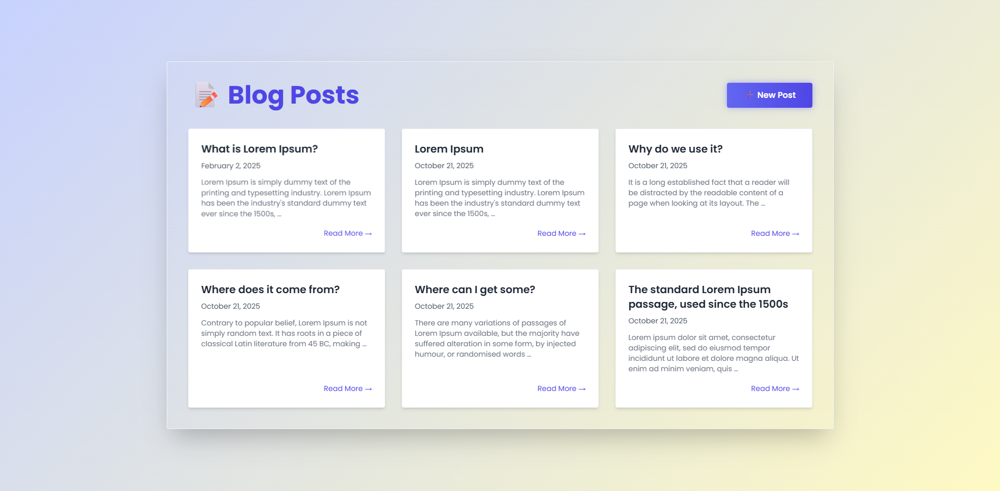

# Blog Platform Web

A web application built with Django that allows users to create, edit, delete, and view blog posts. Each post can have a title, content, tags, and publication date.

## Screenshot


## Installation

### Prerequisites
- Python 3.x
- Django
- Virtual Environment (optional but recommended)

### Steps
1. **Clone the repository:**
    ```sh
    git clone https://github.com/mrrayhan246/project_blog_platform_web.git
    cd project_blog_platform_web
    ```

2. **Create a virtual environment and activate it:**
    ```sh
    python -m venv venv
    source venv/bin/activate  # On Windows use `venv\Scripts\activate`
    ```

3. **Install the required packages:**
    ```sh
    pip install -r requirements.txt
    ```

4. **Set up the Django project:**
    ```sh
    python manage.py migrate
    ```

5. **Run the development server:**
    ```sh
    python manage.py runserver
    ```

6. **Access the application:**
    Open your web browser and go to `http://127.0.0.1:8000`

## Usage
1. Open the application in your web browser.
2. Create a new blog post using the "Add Post" button.
3. Edit or delete your posts using the corresponding buttons.
4. View all published posts on the homepage.
5. Optionally filter posts by tags or authors.

## Technologies Used
- **Backend**: Django
- **Frontend**: Tailwind CSS, JavaScript
- **Database**: SQLite (default, can be changed)
- **Other**: Python, HTML, CSS

## Contributing
Contributions are welcome! Please follow these steps to contribute:
1. Fork the repository.
2. Create a new branch with a descriptive name.
3. Make your changes and commit them.
4. Push your changes to your forked repository.
5. Create a pull request describing your changes.

## Contact
If you have any questions or feedback, please feel free to reach out:
- **Name**: Md. Raihanul Islam (Rayhan)
- **Email**: mrrayhan246@gmail.com

## Badges


## Screenshot

